<!-- HEADER -->
<div align="center">


<a href="https://git.io/typing-svg"></a>

<br/>

[](https://www.python.org/)
[](https://fastapi.tiangolo.com/)
[](https://pytorch.org/)
[](https://www.docker.com/)
<br/>
[](https://react.dev/)
[](https://www.typescriptlang.org/)
[](https://www.linux.org/)
[](https://git-scm.com/)

</div>

---

```text
┌─────────────────────────────────────────────────────────────────────┐
│  AAJ@systems:~$ whoami                                              │
└─────────────────────────────────────────────────────────────────────┘

  Name      »  Aman Amarjit
  Alias     »  AAJ  ·  Reshape The Algorithm (RTA)
  Location  »  Odisha, India
  Status    »  [ ONLINE ]  Building at the intersection of AI & systems

┌─────────────────────────────────────────────────────────────────────┐
│  AAJ@systems:~$ cat focus.json                                      │
└─────────────────────────────────────────────────────────────────────┘

  {
    "primary"   : ["Machine Learning", "LLM Engineering", "NLP Pipelines"],
    "secondary" : ["Security Engineering", "Biometric AI", "Quant Systems"],
    "frontier"  : ["Autonomous Agents", "Human-Machine Interfaces", "Robotics"]
  }

┌─────────────────────────────────────────────────────────────────────┐
│  AAJ@systems:~$ cat highlights.log                                  │
└─────────────────────────────────────────────────────────────────────┘

  ✦  Delivered multi-engine crypto analytics platform for intl. client (CA)
  ✦  2nd Place — Code Verse · HORIZON 2026, IGIT Sarang (Mar 2026)
  ✦  Freelance AI/ML engineer — clients across India & Canada
  ✦  Founder, Reshape The Algorithm (RTA) — AI engineering practice

  AAJ@systems:~$ _
```

---

## ⚡ Projects

| # | Project | Description | Stack | Links |
|---|---------|-------------|-------|-------|
| 01 | **CRYPTO REVERSAL BOT** | Production-grade algorithmic trading system with 15 analytical engines, breakout detection, volatility filtering, and a React/TypeScript dashboard. Built for international client. | `Python` `FastAPI` `React` `TypeScript` `Vite` | — |
| 02 | **KNOWLEDGE SYNTHESIZER** | NLP pipeline that transforms raw audio and text into live semantic knowledge graphs. Extracts entities, infers concept relationships, renders real-time graph topology. | `FastAPI` `NLP` `Graph Rendering` `Python` | [↗ Demo](https://knowledge-synthesizer.netlify.app/) · [↗ Source](https://github.com/Aman-Amarjit/Knowledge-Synthesizer) |
| 03 | **BIOMETRIC ENGINE** | Face recognition running 100% client-side via TensorFlow.js. Zero biometric data ever leaves the browser. JWT sessions + IndexedDB encryption. | `TensorFlow.js` `JWT` `IndexedDB` `Security` | [↗ Demo](https://identity-verification-system.netlify.app/) · [↗ Source](https://github.com/Aman-Amarjit/Face-recognition) |
| 04 | **DISCORD AI PERSONA** | Autonomous social agent with a dynamic mood-state engine (affects tone, pacing, emoji usage), persistent user memory via entity extraction, and multi-key API failover. Deployed via Docker + PM2. | `Gemini API` `Episodic Memory` `Docker` `PM2` | [↗ Source](https://github.com/Aman-Amarjit/discord-ai) |
| 05 | **SOLAR SYSTEM — GESTURE UI** | Full WebGL solar system controlled by real-time hand gesture recognition. No controllers, no clicks. MediaPipe fused with Three.js orbital physics at 30fps. | `Three.js` `MediaPipe` `WebGL` `Computer Vision` | [↗ Demo](https://solarsystemwithhandgestures.netlify.app/) · [↗ Source](https://github.com/Aman-Amarjit/solar-system-using-hand-gesture) |
| 06 | **RULE THE WORLD** | Geopolitical & macroeconomic strategy simulator on a custom modular JS engine — zero framework dependencies. Real-time diplomatic state machines, multi-variable economic modeling. | `Vanilla JS` `Event-Driven` `State Machines` | [↗ Demo](https://ruletheworldmadebyaaj.netlify.app/) · [↗ Source](https://github.com/Aman-Amarjit/RULE-THE-WORLD) |
| 07 | **PERSONAL BUTLER (PANDA AI)** | AI desktop agent with episodic memory, local RAG pipeline, and a cognitive emotion framework (OCC/PAD model). Voice-driven interaction via Whisper. | `Whisper` `FastAPI` `RAG` `Python` | [↗ Source](https://github.com/Aman-Amarjit/personal-butler) |
| 08 | **PLUMBER** | Dual-interface Android service marketplace in Kotlin — real-time technician tracking, booking dashboard, and live status updates. | `Kotlin` `Android` `Firebase` | [↗ Source](https://github.com/Aman-Amarjit/PLUMBER) |

---

<!-- ═══════════════════════ CYBER OMNITRIX STACK ═══════════════════════ -->

<div align="center">


<br/>

# 🌀 TECH MATRIX


<br/><br/>

<!-- THE OMNITRIX UI -->

<br><br>

</div>

<div align="center">


</div>

---

## 📊 GitHub Analytics

<div align="center">
  
  
</div>

<div align="center">
  
  
</div>

---

## 📐 Engineering Doctrine

```text
  ╔═════════════════════════════════════════════════════════════════╗
  ║              T H E   A A J   M A N I F E S T O                 ║
  ╠═════════════════════════════════════════════════════════════════╣
  ║                                                                 ║
  ║  I    ·  Security is not a feature — it is the foundation.     ║
  ║  II   ·  Every abstraction must earn its complexity.           ║
  ║  III  ·  Systems should think. Interfaces should transcend.    ║
  ║  IV   ·  Ship with intent. Refactor with courage.              ║
  ║  V    ·  The best code is the code that doesn't need comments. ║
  ║                                                                 ║
  ╠═════════════════════════════════════════════════════════════════╣
  ║               — Aman Amarjit  ·  AAJ  ·  RTA  ·  2025 —       ║
  ╚═════════════════════════════════════════════════════════════════╝
```

---

## 🔗 Connect

<div align="center">

[](https://www.linkedin.com/in/aman-amarjit-991016368/)
[](https://aman-amarjit.onrender.com/)
[](https://www.instagram.com/amanamarjit8/)
[](mailto:amanamarjit04@gmail.com)

<br/>

<code>AI-Native</code> · <code>Security-First</code> · <code>Systems Thinker</code> · <code>Open to Collaborate</code>

</div>


