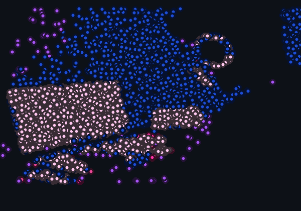

<div align="center">

<!-- CYBERPUNK HEADER -->


[](https://git.io/typing-svg)

</div>

---

<!-- ═══════════════════════════════════════════════════════════════════════ -->
<!--  MAIN CARD PANEL                                                       -->
<!-- ═══════════════════════════════════════════════════════════════════════ -->

<table width="100%" cellspacing="0" cellpadding="0" border="0">
<tr>

<!-- ──── CENTER: PARTICLE PORTRAIT PANEL ────────────────────────────────── -->
<td width="60%" valign="top" align="center">

<br/>

<!-- Cyberpunk Terminal Window Frame -->
<div align="center">



</div>

<br/>

</td>

<!-- ──── RIGHT: System Telemetry ────────────────────────────────────────── -->
<td width="40%" valign="top" align="left">

<br/>

```
┌── OPERATOR TELEMETRY ────────┐
│ Stack ....... Python / TS    │
│ Frontend .... React / Vite   │
│ Backend ..... FastAPI        │
│ AI / ML ..... PyTorch        │
│ Conformal ... MAPIE          │
│ DB .......... PostgreSQL     │
└──────────────────────────────┘
```

<br/>

**🏆 Achievements**

<br/>
<br/>


<br/><br/>

**⚡ Currently Building**

> ⚡ Autonomous AI Agents, Multi-Modal Reasoning Pipelines & High-Performance Deep Learning Systems

<br/>

</td>
</tr>
</table>

---

<div align="center">

## 📊 GITHUB TELEMETRY & METRICS

<br/>

<table border="0" cellspacing="0" cellpadding="0" width="100%">
<tr>
<td width="50%" align="center" valign="top">

</td>
<td width="50%" align="center" valign="top">

</td>
</tr>
</table>

<br/>


</div>

---

<div align="center">

## 🚀 FEATURED PROJECTS

</div>

### ⚡ Conformalized Prediction Agent
> Statistically guaranteed AI prediction sets `P(Y ∈ C(X)) ≥ 95%` trained on **7,023 real benchmark samples**. Automated prediction abstention triage. Sub-15ms latency.

**Stack:** `PyTorch` `FastAPI` `React` `MAPIE` `Conformal Prediction`  
[](https://github.com/Aman-Amarjit/conformalized-brain-tumor-agent)

<br/>

### 🎓 Knowledge Synthesizer 1.0
> AI pipeline converting audio recordings & speeches → structured flashcards, quizzes, and study notes. FastAPI + NLP backend.

**Stack:** `Python` `FastAPI` `NLP` `React` `Whisper`  
[](https://github.com/Aman-Amarjit/Knowledge-Synthesizer-1.0-)

<br/>

### 🪐 Rule The World (3D Simulator)
> 3D orbital physics simulation with hand-tracking gesture controls at 60 FPS. Three.js + Web Workers background processing.

**Stack:** `Three.js` `WebGL` `MediaPipe` `JavaScript`  
[](https://github.com/Aman-Amarjit)

<br/>

### 🌲 Wildfire Early Warning Detector
> Satellite computer vision pipeline detecting early-stage forest fires and thermal anomalies before propagation using PyTorch segmentation.

**Stack:** `PyTorch` `OpenCV` `Satellite Imagery` `FastAPI`  
[](https://github.com/Aman-Amarjit)

---

<div align="center">

## 🛠️ TECH STACK

| Domain | Technologies |
|---|---|
| **Languages** |     |
| **AI / ML** |     |
| **Frontend** |    |
| **Backend** |    |

<br/>

### 🐍 CONTRIBUTION GRID SNAKE

<picture>
  <source media="(prefers-color-scheme: dark)" srcset="https://raw.githubusercontent.com/Aman-Amarjit/Aman-Amarjit/output/github-contribution-grid-snake-dark.svg">
  <source media="(prefers-color-scheme: light)" srcset="https://raw.githubusercontent.com/Aman-Amarjit/Aman-Amarjit/output/github-contribution-grid-snake.svg">
  
</picture>

<br/><br/>

## 🌐 CONNECT

[](https://github.com/Aman-Amarjit/Portfolio)
[](https://www.linkedin.com/in/aman-aman-amarjit-991016368)
[](https://www.instagram.com/amanamarjit8/)
[](mailto:amanamarjit04@gmail.com)

<br/>


</div>
